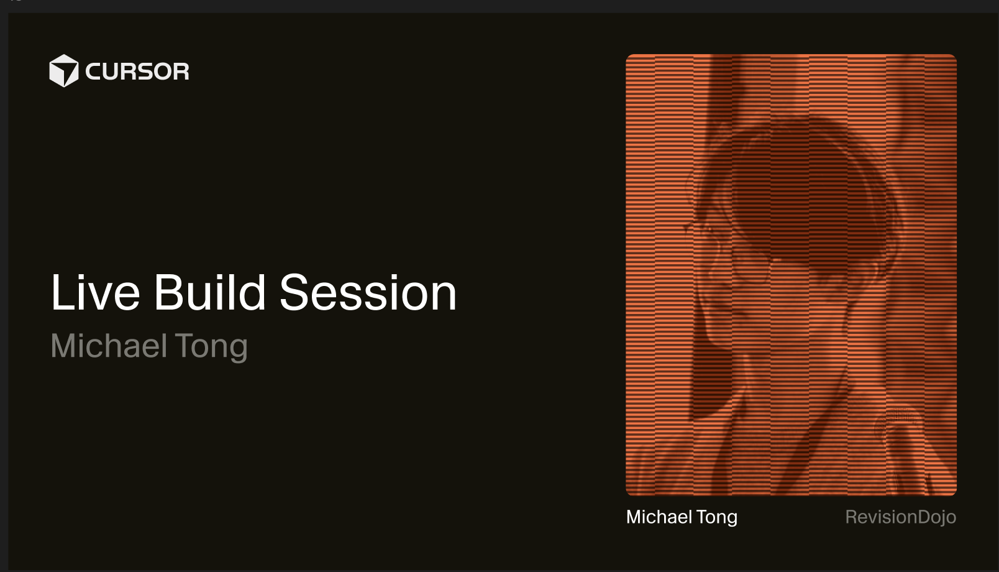
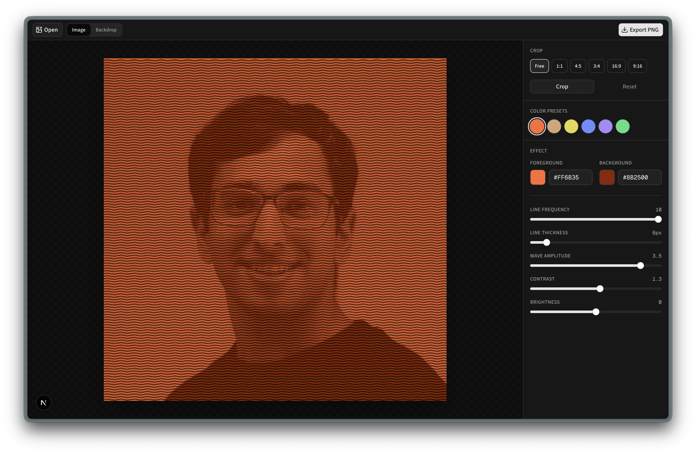
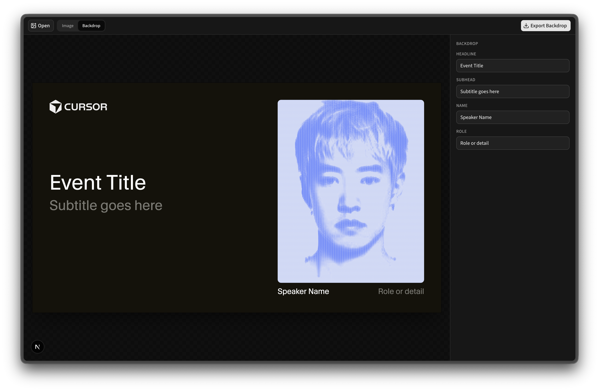

# Event Backdrop

A browser-based editor for turning speaker photos into Cursor-branded event backdrops. Upload a portrait, apply an amplitude-modulated wavy-line duotone, then compose a 4K backdrop with headline, subhead, name, and role — ready for livestreams, stage screens, and social cards.

<p align="center">
  
</p>

<p align="center"><em>Example export: Cursor lockup, event copy, and a wavy-line portrait on a 16:9 backdrop.</em></p>

## What it does

The app has two linked modes:

1. **Image** — Process a photo into the signature wavy-line look (crop, color presets, effect sliders, scan-in animation).
2. **Backdrop** — Drop that processed image into a fixed Cursor layout and edit the on-canvas copy, then export a 4K PNG.

Everything runs client-side in the browser (canvas + Web APIs). No upload server is required.

## Screenshots

### Image mode

Tune the wavy-line effect before composing the backdrop. Crop, pick a color preset (or **Random**), and adjust line frequency, spacing, wave amplitude, contour depth, contrast, and brightness. On open, the preview holds quiet lines then scans the image signal top to bottom. Export the effect alone as PNG, or switch to Backdrop once you’re happy with the look.



### Backdrop mode

Compose the full event card: Cursor lockup, headline/subhead on the left, portrait on the right with name and role captions under the image. Copy updates preview live; **Export Backdrop** downloads a 3840×2160 PNG.



## Quick start

Requirements: Node.js 20+ recommended.

```bash
npm install
npm run dev
```

Open [http://localhost:3000](http://localhost:3000).

| Script | Description |
| --- | --- |
| `npm run dev` | Start the Next.js dev server |
| `npm run build` | Production build |
| `npm start` | Serve the production build |

## How to use

### 1. Open an image

- Click **Open Image** (or **Open** after a file is loaded), or drop a file onto the empty stage.
- Supported: any browser-readable image (`image/*`). Processing stays local.

### 2. Crop (optional)

In **Image** mode, the right sidebar **Crop** section offers:

| Aspect | Typical use |
| --- | --- |
| Free | Unconstrained |
| 1:1 | Square avatars / thumbs |
| 4:5 | Matches the backdrop portrait frame |
| 3:4 | Portrait stills |
| 16:9 / 9:16 | Landscape / vertical frames |

Use **Crop** to enter the cropper, **Apply** / **Cancel** to commit or discard, and **Reset** to restore the original upload.

> Tip: Prefer **4:5** when the photo will sit in a backdrop — that matches the portrait slot in the layout.

### 3. Style the wavy-line effect

Horizontal tracks carry a sine carrier whose **amplitude follows image darkness** (darker → taller waves that pack denser ink). Highlights and the field keep a slight floor ripple.

**Color presets** (ink on a light tinted field):

| Preset | Foreground | Background |
| --- | --- | --- |
| Blue (default) | `#6B8CFF` | `#E8ECF5` |
| Orange | `#FF6B35` | `#EBE6E1` |
| Tan | `#D4A574` | `#F3EDE4` |
| Purple | `#A78BFA` | `#EFEAF5` |
| Green | `#4ADE80` | `#E6F2EA` |

**Random** picks a new ink/field pair and nudges lightness until WCAG contrast is at least 4.5:1 (always on a light field).

**Effect** controls:

| Control | Range | Role |
| --- | --- | --- |
| Foreground / Background | Hex + picker | Line ink and field colors |
| Line frequency | 1–10 | Carrier period (higher → tighter waves) |
| Line spacing | 2–20 px | Vertical pitch between tracks |
| Wave amplitude | 0.5–5 | Peak wave height in dark regions |
| Contour depth | 0–2 | Optional topographic y-bend (default off) |
| Contrast | 0.5–3 | Separates lights and darks before modulation |
| Brightness | −50–50 | Overall lift or crush |

New images scan in from quiet lines to the full effect. Slider tweaks snap to the full reveal. **Export PNG** downloads `sine-wave-image.png`.

### 4. Build the backdrop

Switch the header toggle to **Backdrop** (enabled after a processed image exists).

Edit the sidebar fields:

| Field | On canvas |
| --- | --- |
| Headline | Large title (left) |
| Subhead | Secondary line under the title |
| Name | Caption under the portrait (left) |
| Role | Caption under the portrait (right) |

The stage shows a live composite. **Export Backdrop** downloads `event-backdrop.png` at **3840×2160** (4K). Layout is authored at 1920×1080 design units and rendered at 2× for sharp type and logo.

## Backdrop layout

Fixed composition (design space 1920×1080):

- **Background:** `#14120A`
- **Brand:** Cursor lockup (`public/brand/cursor-lockup.svg`), 80px inset from the top-left
- **Type:** Headline white, subhead/role grey (`#7A7972`)
- **Portrait:** 4:5 cover crop on the right with 16px corner radius; name + role captions below
- **Title block:** Vertically centered against the portrait stack, word-wrapped within the left column

## Project structure

```
app/
  page.tsx              # Editor shell: modes, crop, effect, backdrop, export
  layout.tsx            # Metadata + fonts
components/
  image-uploader.tsx    # Empty-state dropzone
  image-cropper.tsx     # react-easy-crop stage
  crop-controls.tsx     # Aspect + crop actions
  color-presets.tsx     # Duotone swatches + random pair
  effect-controls.tsx   # Colors + effect sliders
  sine-wave-stage.tsx   # Live canvas preview + scan animation
  mode-toggle.tsx       # Image ↔ Backdrop
  backdrop-controls.tsx # Headline / subhead / name / role
  backdrop-stage.tsx    # Backdrop preview
lib/
  process-sine-wave.ts  # Amplitude-modulated wavy lines (canvas)
  effect-settings.ts    # Defaults, presets, contrast-safe random colors
  crop-image.ts         # Crop → data URL
  crop-aspects.ts       # Aspect presets
  backdrop.ts           # 4K canvas compositor
public/
  brand/cursor-lockup.svg
  editor-image-mode.png
  editor-backdrop-mode.png
  backdrop-example.png
```

## Stack

- [Next.js](https://nextjs.org) 16 (App Router)
- React 19
- TypeScript
- Tailwind CSS 4 + [shadcn/ui](https://ui.shadcn.com)
- [react-easy-crop](https://github.com/ValentinH/react-easy-crop) for cropping
- Canvas 2D for the wavy-line effect and backdrop export

## Notes

- Processing and export happen entirely in the browser. Small uploads are upscaled (and large ones capped) so line spacing and wave frequency have enough pixels.
- Backdrop mode uses the **processed** image, not the raw upload — finish crop and effect settings in Image mode first.
- Brand assets (lockup) live under `public/` and are loaded by the canvas renderer at export time.
- `prefers-reduced-motion` skips the scan-in animation and shows the full effect immediately.
